## Sobre el proyecto

Aquó predigo si un cliente contratará un **depósito a plazo fijo** a partir de datos de una campaña de telemarketing bancario (`bank.csv`, una versión revisada del *Bank Marketing Dataset*). Mi objetivo es entrenar un modelo que resuelva un problema de negocio real: **¿a qué clientes debería llamar el banco para maximizar las suscripciones y minimizar el tiempo de sus trabajadores?**

Cada desición dentro del proyecto la respaldé con un análisis estadístico o una validación empírica.

### Puntos claves del proyecto

- **Estadística**: elegí tests según los supuestos de los datos. Mann-Whitney U y correlación Point-Biserial para variables numéricas (que no asumen linealidad ni normalidad), Chi-cuadrado y Cramér's V para variables categóricas, y Mutual Information para detectar relaciones no lineales que los métodos anteriores no capturan bien.
- **Feature engineering**: hice creación de variables (`contacted_before`), tratamiento de valores centinela (`pdays = -1`), y detección temprana de *data leakage* y multicolinealidad.
- **Feature selection**: Feature Importance y Permutation Importance con Random Forest validadas con Stratified 5-Fold Cross-Validation
- **Selección de modelo**: comparé Árbol de Decisión, Random Forest y XGBoost, además de descartar modelos basados en distancia (KNN, SVM) debido a presencia de outliers y relaciones no lineales en los datos.
- **Ajuste de hiperparámetros reproducible**: la definición de hiperaparámetros la hice usando cross-validation para `max_depth` y `n_estimators`.
- **Evaluación orientada a negocio**: la métrica de selección final no es accuracy sino Recall. Esto debido a estimaciones de costo real de falsos negativos vs. falsos positivos.
- **Extra**:  incluí una simulación de aplicación. Ranking de clientes nuevos por probabilidad de suscripción.
### Stack

`pandas` · `numpy` · `matplotlib` / `seaborn` · `scipy.stats` · `scikit-learn` · `xgboost`

### Pipeline del proyecto

El siguiente diagrama resume el flujo completo, de principio a fin:

```mermaid
graph TD
    classDef titleBox fill:#ffffff,stroke:#000000,stroke-width:3px,font-size:22px,font-weight:bold;

    subgraph S1 [" "]
        style S1 fill:#d5f5e3,stroke:#2e7d32,stroke-width:2px
        T1["Carga y Preprocesamiento Inicial"]:::titleBox
        A1[Carga de datos: bank.csv]
        A2["Exploración inicial: shape, dtypes, describe()"]
        A3["Conversión yes/no → booleano<br/>(default, housing, loan, deposit)"]
        A1 --> A2 --> A3
        T1 ~~~ A1
    end

    subgraph S2 [" "]
        style S2 fill:#d6eaf8,stroke:#1565c0,stroke-width:2px
        T2["Feature Engineering"]:::titleBox
        B1["Análisis de pdays<br/>(histograma + boxplot)"]
        B2["Variable nueva: contacted_before<br/>(flag binario de contacto previo)"]
        B3["Imputación de -1 con la mediana<br/>(robusta a asimetría, vs. usar la media)"]
        B4["Revisión de nulos y categorías 'unknown'<br/>(se conservan: aportan información)"]
        B1 --> B2
        B1 --> B3
        B2 --> B4
        B3 --> B4
        T2 ~~~ B1
    end

    subgraph S3 [" "]
        style S3 fill:#fcf3cf,stroke:#f5b041,stroke-width:2px
        T3["EDA Univariado y Visualización"]:::titleBox
        C1["Distribución de deposit<br/>(countplot) → clases balanceadas"]
        C2["Histogramas + Boxplots<br/>de variables numéricas (outliers, asimetría)"]
        C3["Boxplots numéricas vs deposit<br/>→ candidatas: duration, pdays, previous"]
        C1 --> C2 --> C3
        T3 ~~~ C1
    end

    subgraph S4 [" "]
        style S4 fill:#e8daef,stroke:#7d3c98,stroke-width:2px
        T4["Estadística Inferencial — Numéricas"]:::titleBox
        D1["Mann-Whitney U<br/>(no asume normalidad — ideal aquí)"]
        D2["Correlación Point-Biserial<br/>(mide relación lineal, complementa Mann-Whitney)"]
        D3["Contradicción en 'age' →<br/>relación no lineal / no monótona"]
        D4["Exclusión de duration<br/>(data leakage: solo se conoce post-llamada)"]
        D5["Mutual Information<br/>(detecta relaciones no lineales, valida 'age')"]
        D1 --> D3
        D2 --> D3
        D3 --> D5
        D4 --> D5
        T4 ~~~ D1
    end

    subgraph S5 [" "]
        style S5 fill:#fdebd0,stroke:#ca6f1e,stroke-width:2px
        T5["Estadística Inferencial — Categóricas"]:::titleBox
        E1["Countplots + gráficos de barra<br/>(tasa de conversión por categoría)"]
        E2["Chi-cuadrado de independencia<br/>(¿la asociación es significativa?)"]
        E3["Cramér's V<br/>(mide la fuerza de esa asociación)"]
        E4["Heatmap de correlación<br/>→ contacted_before vs previous (r=0.62)"]
        E5["Exclusión de contacted_before<br/>(evita multicolinealidad)"]
        E1 --> E2 --> E3
        E4 --> E5
        T5 ~~~ E1
    end

    subgraph S6 [" "]
        style S6 fill:#d1f2eb,stroke:#0e6655,stroke-width:2px
        T6["Validación de la Selección de Variables"]:::titleBox
        F1["Random Forest: Feature Importance (Gini)<br/>contrasta variables incluidas vs. excluidas"]
        F2["Permutation Importance<br/>(corrige sesgo de RF hacia alta cardinalidad, ej. day)"]
        F3["Stratified 5-Fold CV<br/>(preserva proporción de clases) → comparación incremental con/sin variable"]
        F4["Selección final: 10 variables<br/>(5 numéricas + 4 categóricas + housing)"]
        F1 --> F2 --> F3 --> F4
        T6 ~~~ F1
    end

    subgraph S7 [" "]
        style S7 fill:#eaeded,stroke:#566573,stroke-width:2px
        T7["Preparación para Modelado"]:::titleBox
        G1["One-Hot Encoding<br/>(evita jerarquías falsas en categóricas)"]
        G2["Train/Test Split 80/20<br/>stratify=y (preserva proporción de clases)"]
        G1 --> G2
        T7 ~~~ G1
    end

    subgraph S8 [" "]
        style S8 fill:#fadbd8,stroke:#c0392b,stroke-width:2px
        T8["Entrenamiento y Ajuste de Hiperparámetros"]:::titleBox
        H1["Árbol de Decisión<br/>max_depth vía 5-fold CV (grid 1–10)"]
        H2["¿Por qué no KNN / SVM / lineales?<br/>outliers + relaciones no lineales → Random Forest"]
        H3["Random Forest<br/>n_estimators vía 5-fold CV (100–200)"]
        H4["XGBoost — boosting secuencial<br/>hiperparámetros estándar, validados con 5-fold CV"]
        H1 --> H2 --> H3 --> H4
        T8 ~~~ H1
    end

    subgraph S9 [" "]
        style S9 fill:#fce4ec,stroke:#ad1457,stroke-width:2px
        T9["Evaluación y Decisión de Negocio"]:::titleBox
        I1["Matrices de confusión<br/>(3 modelos comparados)"]
        I2["Accuracy, Precision, Recall, F1, ROC-AUC"]
        I3["Curvas ROC"]
        I4["Recall priorizado<br/>(negocio: falso negativo = venta perdida)"]
        I5["XGBoost seleccionado<br/>(mejor recall y AUC; trade-off interpretabilidad/costo)"]
        I6["Aplicación de negocio: ranking por probabilidad<br/>→ Top-800, lift vs. selección aleatoria"]
        I1 --> I2 --> I3 --> I4 --> I5 --> I6
        T9 ~~~ I1
    end

    %% Conexiones entre secciones para forzar el apilamiento vertical
    A3 --> S2
    B4 --> S3
    C3 --> S4
    D5 --> S5
    E5 --> S6
    F4 --> S7
    G2 --> S8
    H4 --> S9
```

